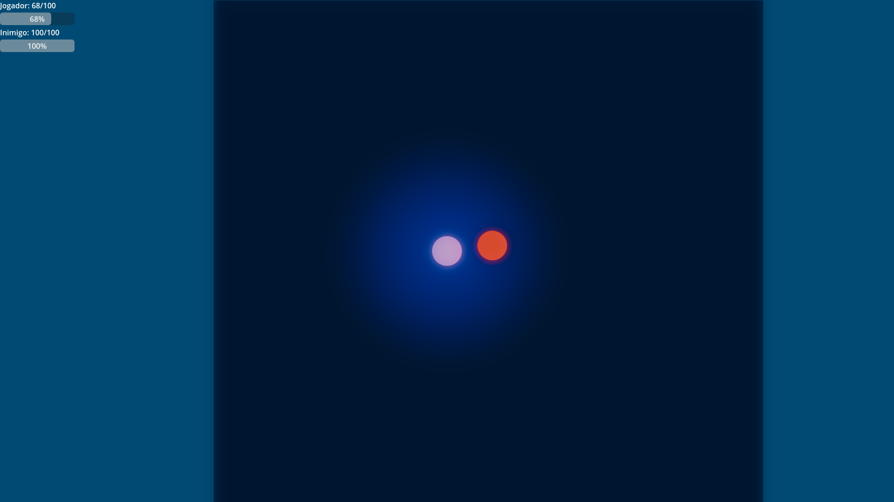

# ⚔️ AI Arena

Entre na arena e enfrente inimigos controlados por diferentes **tipos de Inteligência Artificial**!
Cada inimigo possui sua própria lógica e estratégia, colocando você diante de desafios cada vez mais inteligentes.

---

## 🤖 Tipos de inimigos

1. **🌳 Árvore de Decisão** → Patrulha a área e, se o jogador se aproxima, persegue e ataca.
2. **🪢 Árvore de Comportamento** → Mais refinada: patrulha, persegue, ataca e recua quando está com pouca vida.
3. **🧠 Rede Neural** → Aprende a prever os seus movimentos e antecipa suas ações.
4. **📈 Aprendizado por Reforço** → Evolui em tempo real ou simulado, adaptando-se ao seu estilo de jogo.

---

## 🎮 Controles

* **Setas do teclado** → Movimentar
* **Z** → Atacar
* **R** → Reiniciar o jogo

---

## 🛠️ Ferramentas utilizadas

* Godot Engine
* GDScript
